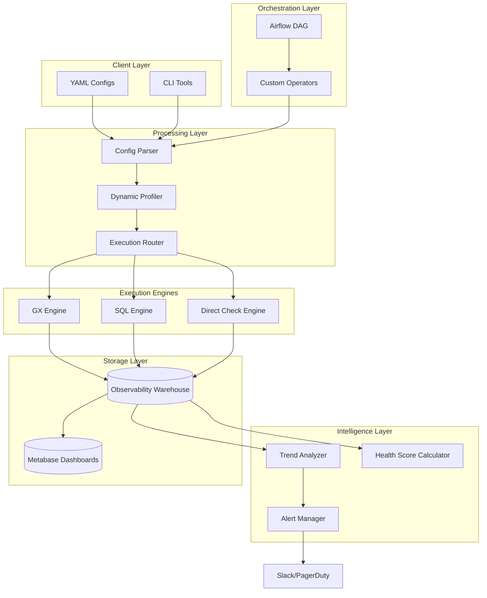

# Architecture Deep Dive

## System Overview

The Production Data Observability Platform is built on a **hybrid execution architecture** that intelligently routes validation checks to the most efficient backend while maintaining a centralized observability store for trend analysis and alerting.



## Core Components

### 1. Configuration Parser

**Purpose**: Validate and parse YAML-based dataset definitions

**Key Features**:
- Pydantic-based schema validation
- Type checking and constraint enforcement
- Support for complex column-level rules
- Extensible for custom validation logic

**Design Pattern**: Builder pattern for configuration objects

### 2. Dynamic Profiler

**Purpose**: Automatically generate baseline expectations from data analysis

**Algorithm**:
1. Sample data from source (configurable size)
2. Analyze column statistics (null rate, cardinality, distribution)
3. Pattern detection (emails, dates, categorical values)
4. Generate appropriate expectations based on patterns
5. Merge with user-defined expectations

**Performance**: O(n) where n = sample size, independent of full dataset

### 3. Execution Router

**Purpose**: Intelligently route tests to optimal execution backend

**Routing Logic**:

```python
if test_type in ['freshness', 'volume']:
    → Direct Check Engine (fastest)
elif test_type in ['referential_integrity', 'cross_table']:
    → SQL Engine (optimized for joins)
elif dataset_size > threshold and test_requires_full_scan:
    → SQL Engine (better for large datasets)
else:
    → GX Engine (best for column-wise operations)
```

**Optimizations**:
- Historical performance tracking
- Dataset size-based routing
- Parallel execution planning

### 4. Execution Engines

#### GX Engine
- **Use Case**: Column-wise validations
- **Sampling**: Configurable sampling for large datasets
- **Performance**: Sub-linear scaling via sampling

#### SQL Engine
- **Use Case**: Multi-table operations, aggregates
- **Optimization**: Push-down predicates, query optimization
- **Performance**: Leverages database query planner

#### Direct Check Engine
- **Use Case**: Metadata checks (freshness, volume)
- **Performance**: Constant time O(1) operations
- **Reliability**: Direct SQL queries, no framework overhead

### 5. Observability Warehouse

**Schema Design**: Star schema optimized for analytical queries

**Fact Tables**:
- `validation_runs`: Each validation execution
- `test_results`: Individual test outcomes
- `alerts`: Triggered alerts

**Dimension Tables**:
- `datasets`: Dataset metadata
- `tests`: Test definitions
- `health_scores`: Computed health metrics

**Partitioning Strategy**:
- Time-based partitioning on `run_timestamp`
- Retention policy: 90 days detailed, 1 year aggregated

### 6. Trend Analyzer

**Purpose**: Distinguish transient failures from systemic issues

**Statistical Methods**:
- Moving average (window: 24 hours)
- Consecutive failure counting
- Failure rate thresholds (configurable)
- Trend direction using linear regression

**Algorithm**:
```python
if consecutive_failures >= threshold:
    return ALERT
elif failure_rate > threshold:
    return ALERT
elif trend == 'degrading':
    return ALERT
else:
    return SUPPRESS  # Likely transient
```

### 7. Alert Manager

**Routing Table**:

| Criticality | Destinations | Acknowledgment Required |
|-------------|--------------|-------------------------|
| P1 | PagerDuty + Slack | Yes |
| P2 | Slack | No |
| P3 | Dashboard Only | No |

**Deduplication**: Hash-based on (dataset, test_type, hour) to prevent alert storms

**Escalation**: Automatic P2→P1 escalation after 60 minutes unacknowledged

### 8. Health Score Calculator

**Formula**:
```
Health Score = (Quality × 0.50) + (Freshness × 0.25) + (Volume × 0.15) + (Trend × 0.10)
```

**Component Scores**:
- **Quality**: Test pass rate (0-100)
- **Freshness**: Recency of last update (0-100, exponential decay)
- **Volume**: Deviation from expected volume (0-100)
- **Trend**: Improvement/degradation direction (0-100)

## Data Flow

### Validation Execution Flow

1. **Trigger**: Airflow scheduler or manual trigger
2. **Load Config**: Parse YAML configuration
3. **Profile**: Generate/load expectations
4. **Route**: Create execution plan
5. **Execute**: Run validations across engines
6. **Store**: Write results to warehouse
7. **Analyze**: Trend analysis and health score calculation
8. **Alert**: Trigger notifications if needed

### Alert Flow

1. **Validation Failure**: Test fails during execution
2. **Trend Check**: Analyze historical failures
3. **Decision**: Should alert? (based on trend)
4. **Create Alert**: Store in warehouse
5. **Route**: Determine destination(s) based on severity
6. **Deliver**: Send to Slack/PagerDuty
7. **Track**: Monitor acknowledgment status

## Scalability Considerations

### Horizontal Scaling
- Airflow workers can scale independently
- Database read replicas for dashboards
- Redis for distributed caching

### Vertical Scaling
- Configurable sampling rates
- Query result caching
- Lazy loading of historical data

### Performance Targets
- **Validation Time**: < 5 minutes for 100GB dataset
- **Alert Latency**: < 1 minute from failure to notification
- **Dashboard Load**: < 3 seconds for health overview

## Security Architecture

### Data Access
- Read-only database connections for validation
- Separate warehouse credentials
- Encrypted credentials in Airflow connections

### Alert Security
- Webhook URL encryption
- API key rotation support
- Audit log for all alerts

## Extensibility Points

### Custom Expectations
```python
class CustomExpectation(Expectation):
    def _validate(self, configuration):
        # Custom validation logic
        pass
```

### Custom Alert Channels
```python
class CustomAlertChannel:
    def send(self, alert):
        # Custom delivery logic
        pass
```

### Custom Profiling Logic
```python
class CustomProfiler(DataProfiler):
    def _auto_profile_column(self, df, column):
        # Custom pattern detection
        pass
```

## Future Enhancements

1. **ML-Based Anomaly Detection**: Use isolation forests for volume anomalies
2. **Streaming Validation**: Real-time validation on Kafka streams
3. **Data Lineage Integration**: Track upstream/downstream dependencies
4. **Cost Optimization**: Automatic query cost estimation and optimization
5. **Multi-Cloud Support**: Native integration with AWS, GCP, Azure data services
